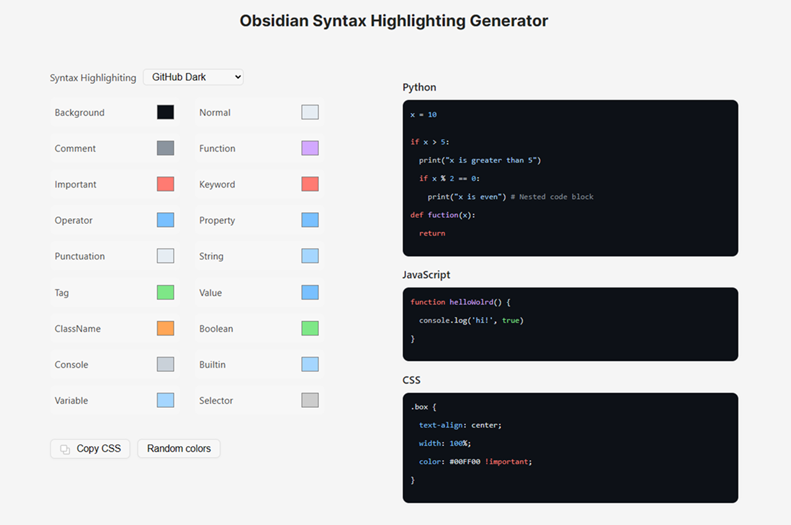

# Obsidian Syntax Highlighting Generator

Generate your own syntax highlighting and use it in Obsidian.

Demo: https://juanchiparra.github.io/obsidian-syntax-highlighting-gen/



### For future upgrade
- Fix inconsistency in the generator
- Add multiple default styles
- Improve "Random Color" logic for better combinations

## How to Use
- Go to the [demo](https://juanchiparra.github.io/obsidian-syntax-highlighting-gen/)
- **Select your colors:** Choose a default syntax highlighting, select colors for each element, or use "Random Colors"
- **Get your code:** Click the "Copy CSS" button and paste it into a .css file
- Save the file in your Obsidian vault (.obsidian/snippets/)
- Activate the snippet: In Obsidian, go to Settings > Appearance > CSS Snippets and select your file
- Enjoy your new syntax highlighting

## Project structure
```
astro-life-in-weeks/
├── src/
│   ├── components/
│   ├── layouts/
│   ├── pages/
│   ├── syntax-highlighting.ts
├── astro.config.mjs
├── package-lock.json
├── package.json
├── README.md
└── tsconfig.json

```

## Getting started
```bash
# Clone this repository
git clone https://github.com/juanchiparra/obsidian-syntax-highlighting-gen.git
cd obsidian-syntax-highlighting-gen
    
## Install the dependencies
npm install
    
## Start the development server
npm run dev
```

## Commands
- `npm run dev`
- `npm run build`
- `npm run preview`

> [!CAUTION]
> If you are going to upload it to GitHub, make sure to set up astro.config.mjs and workflows/deploy.yml

## Contributions
Contributions are welcome! If you encounter a problem or have an idea to improve the project, open an issue or send a pull request.

